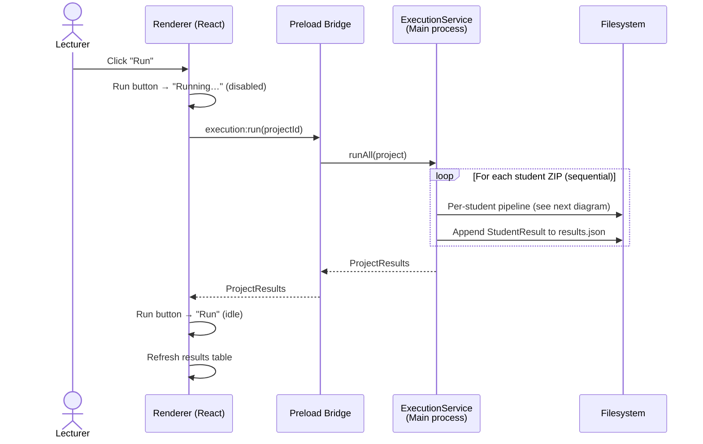
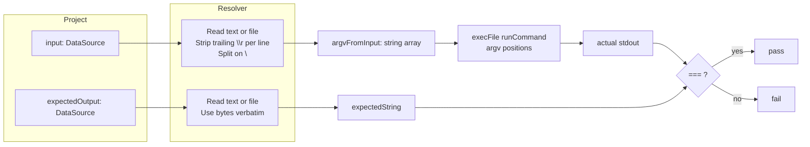

# Evaluation Flow — Design Specification

**Date:** 2026-04-29
**Status:** Approved (refines `2026-04-20-iae-design.md`)
**Scope:** This document specifies the per-student evaluation pipeline (input passing, execution, output comparison) for the IAE. It supersedes the input/comparison sections of the original IAE spec while leaving the rest of that document intact.

---

## Why this spec exists

The original spec (`2026-04-20-iae-design.md`) modeled a project's input as a single `programArgs` string and the expected output as a single `expectedOutput` string with strict char-for-char comparison. Two issues surfaced once we walked through the actual evaluation pipeline:

1. **Input source.** The project description allows the lecturer to type input directly OR point to a text file. The original spec only modeled the typed case.
2. **Tokenization and execution semantics.** The original spec didn't define how a string of args becomes individual `argv` entries, nor how template variables get substituted without exposing the lecturer to shell-quoting hazards.

This spec resolves both, plus pins down the per-student pipeline, error handling, and UI feedback so the implementation can be unambiguous.

---

## Locked design decisions

| Decision | Choice | Reason |
|---|---|---|
| Input source | Typed text **or** file path | Matches description ("a file that contains the strings ... could be passed as command line arguments to `main`") |
| Input tokenization | Newline-split (one arg per line) | Spaces preserved within a line; trivial to author both in UI and in a file |
| Test cases per project | Exactly one (one input + one expected output) | Matches description literally; multi-test deferred |
| Expected output source | Typed text **or** file path | Symmetric with input |
| Comparator | **Strict byte-for-byte** equality. No normalization. | Lecturer's explicit choice. Diff UI exposes whitespace differences clearly so failures are diagnosable. |
| Pipeline order | Sequential (one student at a time) | Predictable, simple progress UI, no contention on shared executables |
| Working directory | The student's extracted folder (in-place) | Simplest, no copying overhead |
| Stdin on child process | **Closed** | Programs that try to read stdin get EOF immediately and exit, instead of hanging until timeout |
| Compile artifacts | **Left in place** by default; manual "Clean up artifacts" button on the project page | Helps the lecturer debug; cleanup is opt-in |
| Run button feedback | Loading state ("Running…") for the duration of the batch; no per-student live progress bar | Simpler UI; results table populates when done |
| Process spawning | `child_process.execFile` (not `exec`) — no shell | Eliminates shell-quoting and shell-injection concerns |
| Per-execution timeout | 10 seconds (configurable in code, not exposed in UI v1) | Catches infinite loops without surprise |
| Robustness | Each student wrapped in try/catch; one student's failure never blocks another | Matches description: "must continue with the next student" |

---

## Flow diagrams

### Batch run — system-level

What happens when the lecturer clicks **Run** on a project:



The renderer never receives mid-run progress events in v1 — the request promise's lifecycle alone drives the button's loading state. The results table refreshes once the promise resolves.

### Per-student pipeline

What happens for a single student inside the loop:

```mermaid
flowchart TD
    Start([Next student ZIP]) --> Extract[Extract ZIP<br/>→ submissions/studentId/]
    Extract -- fail --> ZipErr[/status: zip_error/]
    Extract -- ok --> Locate{Source file<br/>at folder root?}

    Locate -- no --> MissingSrc[/status: missing_source/]
    Locate -- yes --> HasCompile{Configuration has<br/>compileCommand?}

    HasCompile -- no --> ResolveInput
    HasCompile -- yes --> Compile[execFile compileCommand<br/>cwd = studentFolder]

    Compile -- exit non-zero<br/>or ENOENT --> CompileErr[/status: compile_error/]
    Compile -- exit 0 --> ResolveInput[Resolve input<br/>text or file<br/>→ argv array]

    ResolveInput --> Run[execFile runCommand<br/>argv = template + input<br/>stdin closed, timeout 10s]

    Run -- timeout --> Timeout[/status: timeout/]
    Run -- exit non-zero<br/>or ENOENT --> RuntimeErr[/status: runtime_error/]
    Run -- exit 0 --> ResolveExpected[Resolve expected output<br/>text or file<br/>→ string]

    ResolveExpected --> Compare{actual stdout<br/>=== expected ?}

    Compare -- yes --> Pass[/status: pass/]
    Compare -- no --> Fail[/status: fail/]

    ZipErr --> Persist
    MissingSrc --> Persist
    CompileErr --> Persist
    Timeout --> Persist
    RuntimeErr --> Persist
    Pass --> Persist
    Fail --> Persist

    Persist[Append StudentResult<br/>to results.json]
```



Every leaf state ends in a recorded `StudentResult`; the loop in the system-level diagram then advances to the next student. No exception escapes a student's pipeline.

### Data flow for input and expected output

The two `DataSource` fields go through the same resolver shape but feed different consumers:



Note the asymmetry: input goes through line-splitting (becomes argv); expected output is used as raw bytes (compared whole). This is deliberate — see the strict-comparator note in step 4 of the per-student pipeline.

---

## Data model refinements

The `Project` interface in `shared/types.ts` changes as follows:

```typescript
// Discriminated union — captures whether the value is typed text or a file path
export type DataSource =
  | { type: 'text'; value: string }
  | { type: 'file'; path: string };

export interface Project {
  id: string;
  name: string;
  configurationId: string;
  configuration: Configuration;          // snapshot at creation time

  input: DataSource;                     // [R7] replaces `programArgs: string`
  expectedOutput: DataSource;            // [R8] replaces `expectedOutput: string`

  submissionsDir: string;                // [R6]

  createdAt: string;
  updatedAt: string;
}
```

**Migration note:** there are no persisted projects yet (greenfield), so no on-disk migration is needed — just update the type and the construction sites.

`Configuration`, `StudentResult`, and `ProjectResults` remain as defined in the original spec. `StudentResult.expectedOutput` and `StudentResult.actualOutput` continue to hold the **resolved** strings (post file-read), not the source descriptors.

---

## Per-student pipeline

The pipeline runs once per extracted submission folder. Steps below; any uncaught exception in any step degrades gracefully to the listed status and the loop continues to the next student.

```
1. Extract ZIP                        → submissions/{studentId}/
2. Locate source file                 → fail: missing_source
3. Compile (if compileCommand set)    → fail: compile_error
4. Resolve input (text or file read)  → fail: zip_error / runtime_error class
5. Run executable with argv           → fail: timeout | runtime_error
6. Resolve expected output            → fail: zip_error class
7. Compare stdout vs expected (==)    → pass | fail
8. Append StudentResult to results.json
```

### Step details

**1. Extract ZIP**
- `studentId` = ZIP filename without the `.zip` extension. (Description: "a directory with the student ID is created when each ZIP file is unzipped.")
- Extracted into `submissions/{studentId}/`.
- Failure → status `zip_error`; skip remaining steps.

**2. Locate source file**
- Look for `configuration.sourceFileExpected` (e.g., `main.c`) at the **root** of the extracted folder.
- Not found → status `missing_source`; skip remaining steps.

**3. Compile** (only if `configuration.compileCommand` is set)
- Substitute template variables in `configuration.compileArgs`:
  - `{{sourceFile}}` → the located source file's name (e.g., `main.c`)
  - `{{outputName}}` → source file name without extension (e.g., `main`)
- Tokenize the substituted args on whitespace (v1 limitation: no quoting; args containing spaces are not supported in v1).
- Spawn: `execFile(compileCommand, tokenizedArgs, { cwd: studentFolder, stdio: ['ignore','pipe','pipe'] })`.
- Capture stdout, stderr, exitCode.
- Non-zero exit → status `compile_error`; record stderr; skip remaining steps.

**4. Resolve input**
- If `project.input.type === 'text'`: use `project.input.value`.
- If `project.input.type === 'file'`: read the file at `project.input.path` as UTF-8.
- Split the resulting string on `\n`, then strip a trailing `\r` from each line. This is **input parsing**, not output normalization — its purpose is that a Windows-saved input file produces clean argv strings instead of strings that end in `\r`. The output comparator is unaffected and remains strict.
- Drop a trailing empty line if the source ended with `\n` (so `"a\nb\n"` becomes `["a","b"]`, not `["a","b",""]`).
- The result is `argvFromInput: string[]` — each line is one `argv` element with internal spaces preserved.

**5. Run**
- Substitute template variables in `configuration.runArgs`:
  - `{{sourceFile}}` → source file name (useful for interpreted languages, e.g., `python main.py`)
  - `{{outputName}}` → compiled output name
  - `{{args}}` → **spread** `argvFromInput` into the position of this token. Each element becomes a distinct `argv` entry.
- Tokenize the rest of `runArgs` on whitespace (same v1 limitation).
- Spawn: `execFile(runCommand, finalArgvArray, { cwd: studentFolder, stdio: ['ignore','pipe','pipe'], timeout: 10000 })`.
- Capture stdout, stderr, exitCode.
  - Process killed by timeout → status `timeout`; skip comparison.
  - Non-zero exit → status `runtime_error`; record stderr; skip comparison.

**6. Resolve expected output** — same logic as step 4 but for `project.expectedOutput`. The resolved value is a single string (no splitting; the file's bytes are used verbatim).

**7. Compare** — `actualStdout === expectedString` (JavaScript triple-equals, both as UTF-8 strings). Match → `pass`; else → `fail`. The actual and expected strings are both stored on the `StudentResult` so the diff UI can render them.

**8. Persist** — append the `StudentResult` to `results/results.json`. Each student is committed individually so a process crash mid-run still preserves prior students' results.

---

## Template variable substitution rules

| Variable | Replaced with | Where allowed |
|---|---|---|
| `{{sourceFile}}` | the located source file name (e.g., `main.c`) | `compileArgs`, `runArgs` |
| `{{outputName}}` | source file name without extension (e.g., `main`) | `compileArgs`, `runArgs` |
| `{{args}}` | the resolved input array, **spread** as multiple `argv` entries | `runArgs` only |

**Substitution algorithm:**
1. Split the args template on whitespace into tokens.
2. For each token: if it equals `{{args}}` exactly, replace by spreading `argvFromInput`. If it contains `{{sourceFile}}` or `{{outputName}}`, do plain string substitution within the token. Otherwise pass through.
3. The result is an array passed directly to `execFile`. No shell involvement.

**v1 limitation:** args containing spaces (e.g., a Windows path with `Program Files`) are not representable in `compileArgs`/`runArgs`. The lecturer can put such paths in `compileCommand`/`runCommand` themselves (those fields are full strings, not tokenized). If quoted-string support becomes necessary later, swap the tokenizer for a shell-lex parser.

---

## Comparison and diff UI

**Engine:** strict equality (`===`) on the two strings. No normalization, no trimming, no line-ending coercion.

**Diff view (StudentDetail page):**
- Side-by-side: expected (left) vs actual (right).
- Toggle: **"Show whitespace markers"** (default on). When on, renders:
  - space → `·`
  - tab → `→`
  - `\r` → `␍`
  - `\n` → `↵\n` (visible glyph plus actual newline so layout is preserved)
  - `\r\n` → `␍↵\n`
- A line-by-line diff highlights differing lines in red; matching lines in default color.

This makes it visually obvious when a failure is "the program output `\n` but the lecturer pasted `\r\n` into the expected field" — without the comparator silently masking it.

---

## Run button states

The run button on the project page has three states:

| State | Trigger | UI |
|---|---|---|
| Idle | No run in progress | Label: "Run", enabled |
| Running | Batch in progress | Label: "Running…", disabled, spinner inside the button |
| Done | Batch completed | Returns to "Run" idle state; results table refreshes below |

No per-student progress bar in v1. Total batch duration is bounded by `studentCount × (compile_time + run_time + 10s_timeout_max)`, which for typical class sizes is acceptable.

---

## "Clean up artifacts" button

A secondary button on the project page: **"Clean up artifacts"**.

Behavior: walks `submissions/{studentId}/` for every student and removes anything **not** the original source file. Specifically: removes any file whose name is not `configuration.sourceFileExpected`. Leaves `submissions/`, the student folders, and source files untouched.

Confirmation modal: "This will delete compiled binaries and any other generated files in every student folder. Source files will be kept. Continue?"

---

## Error handling matrix

Every failure mode produces a recorded `StudentResult` with a status; the loop continues to the next student.

| Failure | Status | Recorded |
|---|---|---|
| ZIP can't be extracted | `zip_error` | exception message |
| Source file not at folder root | `missing_source` | (none) |
| Compile exits non-zero | `compile_error` | compile stdout + stderr + exitCode |
| Compile binary not found (`ENOENT`) | `compile_error` | clear message: "compiler not found: {command}" |
| Input file path set but file missing/unreadable | `runtime_error` | exception message |
| Run binary not found (`ENOENT`) | `runtime_error` | clear message: "executable not found: {command}" |
| Run exceeds timeout | `timeout` | partial stdout + "killed after 10s" note |
| Run exits non-zero | `runtime_error` | run stdout + stderr + exitCode |
| Expected output file missing/unreadable | `runtime_error` | exception message; comparison skipped |
| Output mismatch | `fail` | full actual + full expected |
| Output match | `pass` | full actual |

Top-level run handler catches anything that escapes a student's pipeline and surfaces it as a generic `runtime_error` for that student.

---

## Implementation notes for `ExecutionService`

- Single class, methods: `runAll(project)`, `runStudent(studentDir, project)`, `cleanupArtifacts(project)`.
- `runStudent` returns a `StudentResult` and never throws — exceptions become statuses.
- `runAll` iterates students sequentially, persists each result as it completes, and returns the final `ProjectResults`.
- IPC: `execution:run(projectId)` blocks until the batch completes and returns the `ProjectResults`. The renderer relies on the request's promise lifecycle to drive the run-button loading state — no separate progress channel needed in v1.
- `execution:cleanup(projectId)` is a separate IPC call wired to the cleanup button.

---

## Changes against the original 2026-04-20 spec

The following sections of `2026-04-20-iae-design.md` need to be aligned (or considered superseded):

1. **Data Models → Project**: `programArgs: string` → `input: DataSource`; `expectedOutput: string` → `expectedOutput: DataSource`.
2. **Service Layer → ExecutionService**: signature of `runStudent` simplified; sequential-only; cleanup method added.
3. **Output Comparison**: stays "exact match" (already correct), but adds the diff-UI whitespace-marker toggle.
4. **UI Design → Project Detail**: run button gets three states; "Clean up artifacts" button added.
5. **IPC**: add `execution:cleanup`. The signature of `execution:run` is unchanged.

These edits will be applied to the original spec when this design is approved, with a small note pointing readers at this addendum for the detailed pipeline.

---

## What's intentionally not in v1

- Multiple test cases per project
- Stdin-fed input
- Forgiving comparators (line-trimmed, token-compare, custom checker)
- Floating-point tolerance
- Quoted strings in args templates
- Configurable per-execution timeout in the UI
- Live per-student progress bar
- Parallel student execution

Each is a deliberate scope cut. The data model and pipeline are structured so any of these can be added without breaking changes (e.g., adding a `testCases: TestCase[]` field alongside the current single-test fields, or swapping the comparator for a strategy interface).
