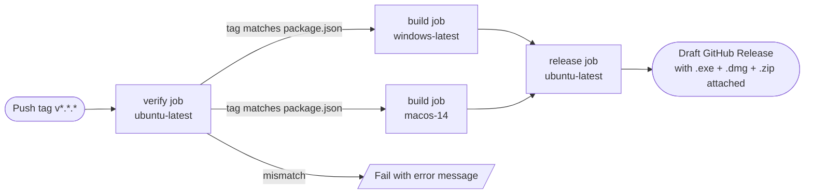

# GitHub Actions Release Pipeline — Design Specification

**Date:** 2026-05-11
**Status:** Approved
**Scope:** Defines a GitHub Actions workflow that, on a version-tag push, builds the Electron app for Windows and macOS and attaches the installers to a draft GitHub Release. Covers workflow triggers, job topology, version validation, electron-builder configuration changes required for cross-platform output, and release publishing behavior.

---

## Why this spec exists

The IAE is distributed as an Electron desktop app. Today, producing a release means running `npm run dist` locally and uploading installers to GitHub by hand. That is error-prone (developer environment leaks into the binary, mismatched versions between `package.json` and the GitHub tag, easy to forget a platform) and only produces installers for whatever OS the developer happens to be on.

This spec defines the CI pipeline that replaces the manual flow. The goal is that after pushing a single `vX.Y.Z` tag the developer can review a draft release on GitHub with reproducible, multi-platform installers attached, then click **Publish** when ready.

---

## Locked design decisions

| Decision | Choice | Reason |
|---|---|---|
| Trigger | Push of a tag matching `v*.*.*` | Single, intentional action; no accidental releases from branch pushes |
| Target platforms | Windows x64 (NSIS installer) and macOS arm64 (DMG + ZIP) | Matches the contributors' machines and demo audience |
| macOS architecture | Apple Silicon only (`arm64`) | Avoids universal-binary complexity; Intel-Mac coverage deferred |
| Code signing | None (unsigned on both OSes) | Out of scope for a coursework deliverable; users accept Gatekeeper / SmartScreen warning |
| Release state | Draft (manual publish) | Lets developer review build outputs and edit release notes before going public |
| Release notes | GitHub auto-generated (`generate_release_notes: true`) | Zero-config "What's Changed" from commit history since previous tag |
| Tag ↔ `package.json` version sync | **Validated** — workflow fails fast if they differ | Prevents installers whose embedded version disagrees with the GitHub release name |
| Node version | 20 LTS | Current LTS; matches local dev expectation |
| Dependency install | `npm ci` from committed `package-lock.json` | Reproducible across runs |
| Native module rebuild (`better-sqlite3`) | Implicit — handled by electron-builder's `@electron/rebuild` integration during `npm run dist` | No custom rebuild step needed in the workflow |
| Concurrency | Group per `github.ref`, `cancel-in-progress: false` | Same tag can't run twice in parallel; new tags don't cancel in-flight builds for earlier tags |
| Permissions | `contents: write` only | Minimum needed for the workflow's `GITHUB_TOKEN` to create a release |
| Secrets | None (default `GITHUB_TOKEN` only) | No third-party services involved |

---

## Workflow topology



One workflow file: `.github/workflows/release.yml`. Three jobs: `verify`, `build` (matrix), `release`. `build` depends on `verify`; `release` depends on `build` (all matrix entries must succeed).

---

## Job specifications

### `verify` job

**Runner:** `ubuntu-latest`
**Purpose:** Refuse to build if the tag and `package.json` disagree.

**Behavior:**

1. Check out the repository at the tag commit.
2. Extract the semver from `github.ref_name` by stripping the leading `v` (e.g., `v1.2.0` → `1.2.0`).
3. Read the `version` field from `package.json` (e.g., `jq -r .version package.json`).
4. If the two strings are not equal, exit non-zero with a message of the form:
   > `Tag v1.2.0 does not match package.json version 1.0.0. Bump package.json and re-tag.`
5. If they match, exit 0. The downstream jobs do not consume any output from `verify` — its only role is to gate the pipeline.

### `build` job

**Runners (matrix):**

| Matrix key | Runner image | electron-builder target | Expected output filenames |
|---|---|---|---|
| `windows` | `windows-latest` | `nsis` (x64) | `Integrated Assignment Environment Setup X.Y.Z.exe` |
| `macos` | `macos-14` | `dmg` + `zip` (arm64) | `Integrated Assignment Environment-X.Y.Z-arm64.dmg`, `Integrated Assignment Environment-X.Y.Z-arm64-mac.zip` |

**Needs:** `verify`.
**Strategy:** `fail-fast: false` so a Windows failure does not cancel an in-flight macOS build (and vice versa) — easier to triage.

**Behavior (identical across matrix entries):**

1. Check out the repository.
2. Set up Node 20 LTS with npm cache enabled (`actions/setup-node@v4` with `cache: 'npm'`).
3. `npm ci` — install from `package-lock.json`.
4. `npm run dist` — runs `tsc && vite build && electron-builder`. electron-builder transparently invokes `@electron/rebuild` on `better-sqlite3` against the matrix runner's Electron ABI before packaging; no explicit rebuild step is required in the workflow.
5. Upload the contents of the `release/` directory matching installer extensions (`*.exe`, `*.dmg`, `*.zip`) as a CI artifact named `installers-${{ matrix.os }}` (e.g., `installers-windows`, `installers-macos`). Namespacing prevents filename collisions when both matrix entries finish.

**Implicit guarantees:**

- The `GITHUB_TOKEN` is **not** passed to electron-builder in this job. Publishing is handled exclusively by the `release` job — keeps responsibilities separate and lets the build step run identically for non-release dry-runs in the future.
- No `--publish` flag is passed to electron-builder.

### `release` job

**Runner:** `ubuntu-latest`
**Needs:** `build` (the entire matrix must succeed before this job runs).
**Permissions:** Top-level workflow `permissions: { contents: write }`. No other scopes.

**Behavior:**

1. Download all CI artifacts uploaded by `build` (`actions/download-artifact@v4` with no `name` filter) into a single staging directory.
2. Create a draft GitHub Release for the pushed tag via `softprops/action-gh-release@v2`:
   - `tag_name`: `${{ github.ref_name }}` (the tag that triggered the workflow)
   - `name`: `Release ${{ github.ref_name }}`
   - `draft`: `true`
   - `prerelease`: `false`
   - `generate_release_notes`: `true` (GitHub composes "What's Changed" + contributor list from commits since the previous tag)
   - `files`: glob over the downloaded `*.exe`, `*.dmg`, `*.zip` files
   - `fail_on_unmatched_files`: `true` (defensive — if upload paths are misconfigured the job fails loudly rather than silently producing an empty release)

The release is left as a draft. The developer reviews it in the GitHub UI, optionally edits the notes, then clicks **Publish release** to make it public.

---

## Required changes outside the workflow file

### `electron-builder.yml`

Add a `mac` section alongside the existing `win` section:

```yaml
mac:
  target:
    - target: dmg
      arch: [arm64]
    - target: zip
      arch: [arm64]
  icon: build/icon.png
  category: public.app-category.developer-tools
```

No changes to the existing `win`, `nsis`, `appId`, `productName`, `directories`, or `files` sections.

### `build/` directory

The current `electron-builder.yml` references `build/icon.ico`, and the macOS section above references `build/icon.png`. **Both files must exist before the workflow can succeed.** Per agreement during brainstorming, the developer (Demir) will provide:

- `build/icon.ico` — Windows icon, 256×256 px minimum, ICO format.
- `build/icon.png` — macOS icon, PNG format ≥ 512×512 px (electron-builder converts this to ICNS internally during the macOS build).

This prerequisite is already flagged in the TODO comment at the top of `electron-builder.yml`. This spec does **not** add an alternative no-icon fallback path.

### `.gitignore`

No changes required. The existing `release/` ignore is correct and applies to local-developer output as well as the CI runners' working directories (though CI runners are ephemeral, so it does not strictly matter there).

---

## End-to-end release procedure

Once the workflow and icons are in place, releasing a new version is:

1. On `main` (or release branch), bump `version` in `package.json` to `X.Y.Z`.
2. Commit: `git commit -am "chore(release): bump version to X.Y.Z"`.
3. Push the commit.
4. Tag: `git tag vX.Y.Z`.
5. Push the tag: `git push origin vX.Y.Z`.
6. Wait for the workflow to finish (~8-10 minutes).
7. Open **Releases** in GitHub. A draft release named `Release vX.Y.Z` should be present with `.exe`, `.dmg`, and `.zip` attached, and auto-generated release notes filled in.
8. Edit notes if desired, then click **Publish release**.

If step 6 fails:

- **`verify` failed:** `package.json` was not bumped. Delete the bad tag (`git tag -d vX.Y.Z && git push --delete origin vX.Y.Z`), bump `package.json`, commit, re-tag, re-push.
- **A `build` matrix entry failed:** Inspect the workflow logs. The other matrix entry's artifacts are still uploaded (via `fail-fast: false`); fix the cause and re-tag with the next patch version.
- **`release` failed:** Most likely a transient `softprops/action-gh-release` issue. Re-run the failed job from the GitHub UI; downloaded artifacts are re-fetched, no rebuild needed.

---

## Out of scope (deferred)

The following are intentionally **not** part of this spec and would each be separate future work:

- **Code signing / notarization** (Windows Authenticode, macOS notarization). Requires paid certificates and adds CI secrets — coursework does not need it.
- **Auto-updates** (`electron-updater`). Requires signed builds and a publish target. Not requested.
- **macOS Intel (x64)** builds. Either a separate matrix entry or a universal binary; deferred until there's a known Intel-Mac user.
- **Linux** builds (AppImage, deb, rpm). Deferred — no current request.
- **Pre-release / RC tagging** (e.g., `v1.2.0-rc1`). Current trigger only matches `v*.*.*`; an `rc` workflow can be added later if needed.
- **Test execution in CI.** The repo currently has no test suite (the Vitest infra was removed in `bfba7ff`); when tests return, a `test` job upstream of `build` will be added.
- **Caching electron-builder's `~/Library/Caches/electron-builder`** (downloaded Electron binaries). The `actions/setup-node` npm cache is enough for v1; can be added later if build times become a problem.
